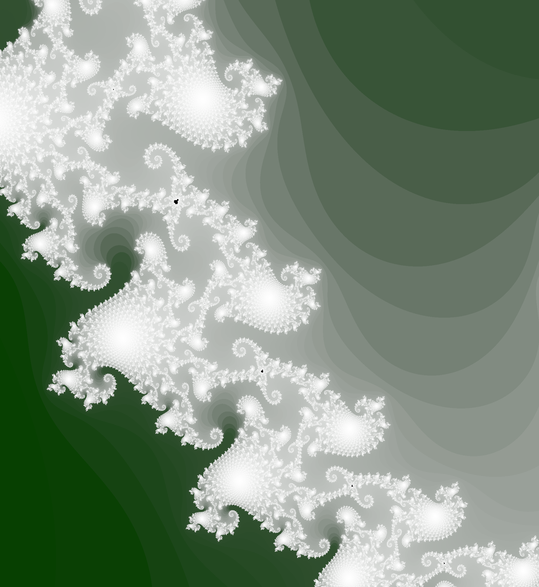
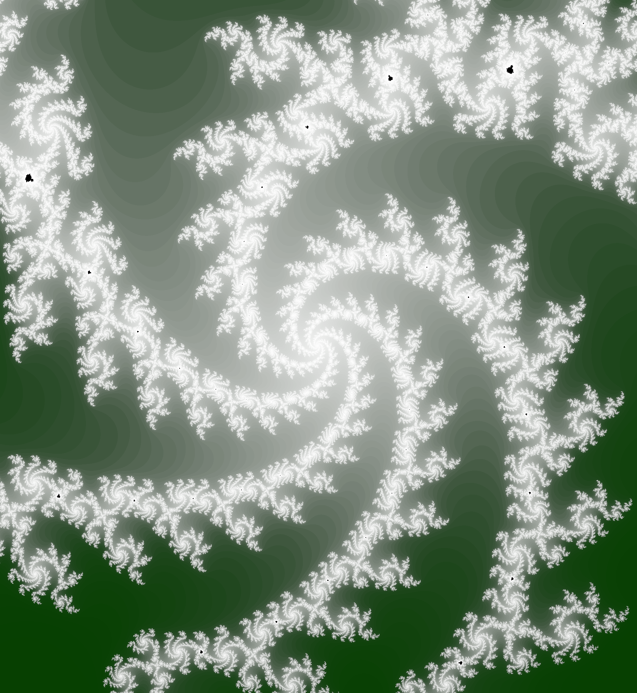

<!-- omit in toc -->
# `wgpu-mandelbrot`

A realtime mandelbrot renderer using [wgpu](https://github.com/gfx-rs/wgpu).

I used this as a practise project to learn some modern graphics fundamentals via `wgpu`.

<!-- omit in toc -->
## Contents

* [Screenshots](#screenshots)
* [Usage](#usage)
  * [Running](#running)
  * [Controls](#controls)
* [Architecture](#architecture)

## Screenshots

## Usage

### Running

`nix develop -c cargo run --release`

### Controls

| Input             | Action                        |
| ----------------- | ----------------------------- |
| Left click        | Center image on clicked point |
| Scroll wheel up   | Zoom in                       |
| Scroll wheel down | Zoom out                      |

## Architecture

Pixel [iterations](https://en.wikipedia.org/wiki/Plotting_algorithms_for_the_Mandelbrot_set#Unoptimized_na%C3%AFve_escape_time_algorithm)
and colours are stored in host memory (RAM).

Rough per-frame breakdown:

1. The remaining unescaped pixels are sent to the GPU
1. A compute shader iterates each pixel
1. The results are copied to host-available memory
1. The CPU partitions the results into newly-escaped and unescaped pixels
1. The newly-escaped pixels are used to re-compute the pixel colours
1. The new pixel colours are sent to the GPU
1. A fragment shader colours each pixel